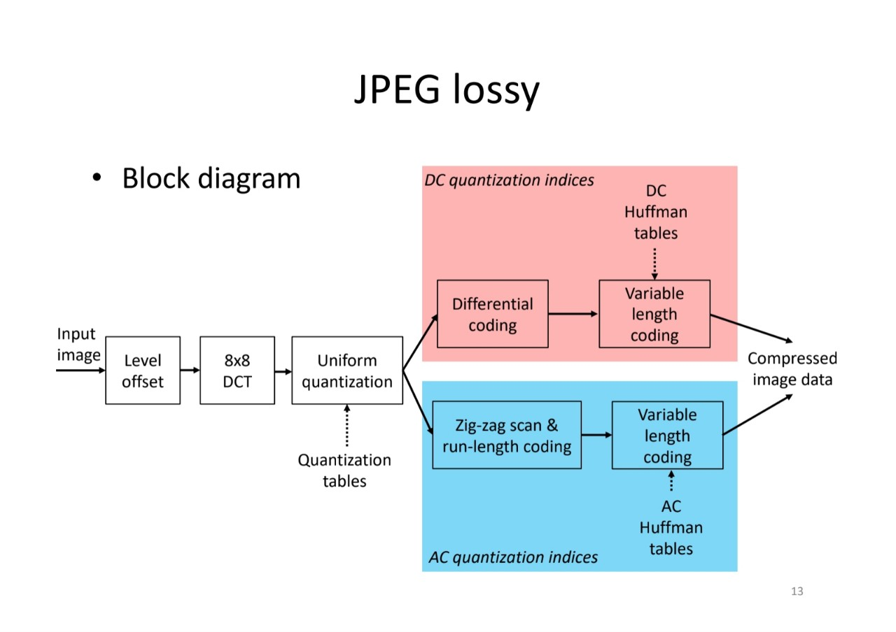
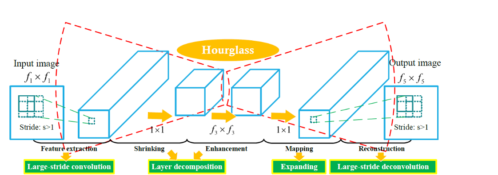

# jpeg compression

jpeg compression과 Deeplearning으로 복원성능을 향상한 jpeg compression
 

directory에 있는 이미지를 q factor에 따라 jpeg으로 encoding 한 후 decoding 하여 다시 복원 하여 
psnr과 ssim을 이용하여 원본과 얼마만큼 비슷한지를 측정(얼마만큼 손실되었는지)

jpeg compresssion시 이미지를 좌우로 뒤집고, rgb to ycbcr로 색값을 변환한 뒤 두개의 값의 차이 값으로 압축하여 용량을 줄임 

후처리로 pytorch framework를 사용하여 arcnn모델을 통해
q factor 70부분에서 sim 0.01 향상. 

## 2. 실행 과정(decoding은 encoding과 역과정이기 떄문에 생략)

1. cv2 img read & img flip left right
2. YCbCr
3. Obtain Ycbcr difference(img - flip img )
4. chroma subsampling
5. transform to block
6. 8X8 DCT
7. quantization
8. zig-zag scan & run-length coding
9. decoding
10. ARCNN

## 3. Result

| JPEG img                                                |
| ------------------------------------------------------- |
|  |

